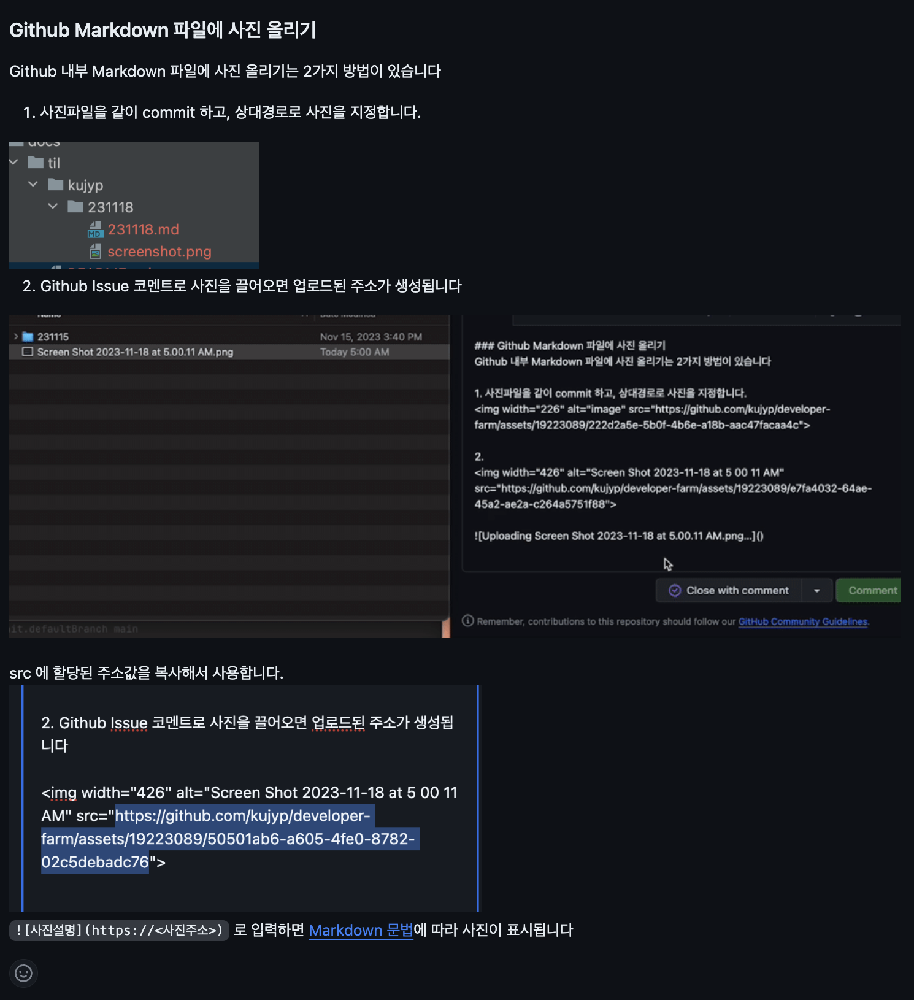

### TIL(Today I Learned)
- 내가 배운것에 대해 기록합니다
- 미래의 나는 지금의 맥락이 잘 기억이 나지 않습니다. 남이 봐도 이해하도록 쉽게써야 미래의 내가 이해할 수 있습니다 
- 본인의 github 계정명을 폴더명으로 만들고 사용합니다
- [.md(Markdown)](https://www.markdownguide.org/basic-syntax/) 파일로 추가합니다.
- 사진파일이 필요한 경우 [Github Markdown 파일에 사진 올리기](https://github.com/kujyp/developer-farm/issues/2#issuecomment-1817030124) 가이드 참조

 
